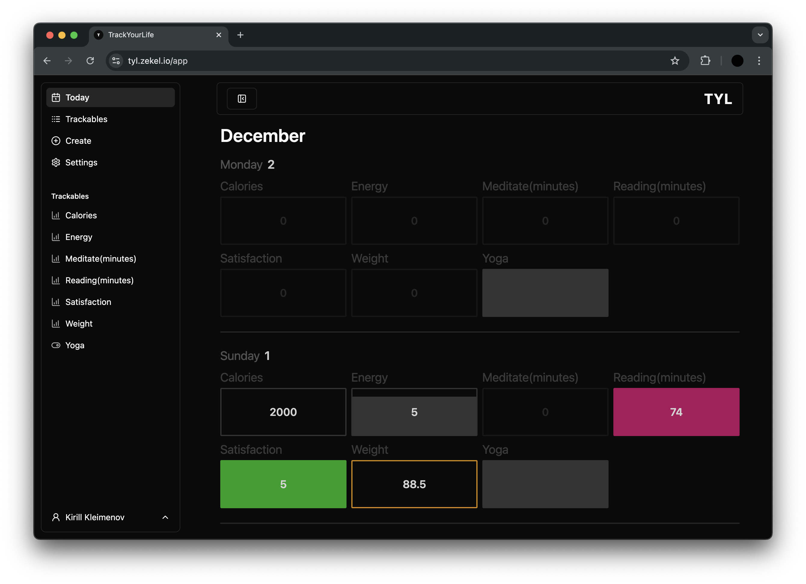

### TrackYourLife

App to track stuff. It started as a self-hosted habit\mood\stats tracker and I want to evolve it into app aggregating all data about you and your environement to ponder on, analyze and get better. Maybe you can call it OSS self-hosted [Exists](https://exist.io/) alternative.

### Current state

updated: 2 December 2024

I use it personally to track my stuff, however it's not stable or production ready. Publically hosted version available at [tyl.zekel.io](https://tyl.zekel.io/) (use at your own risk)

Current goals:

1. Polish the overall experince, refactor ugly stuff, improve design.
2. Data impromenets: grouped trackables, multiple entries for one day, agregated trackables, data conversions.
3. System for API integrations running on CRON or using public api.
4. When it comes out switch to [Zero](https://zero.rocicorp.dev/) for local-first data querying.
5. Develop mobile app

### Development

- Run Postgres somewhere. Create `.env` similar to `.env.example`
- `pnpm i` `pnpm run dev`
- Migrations are applied automatically on startup. To generate migrations after updating schema use `pnpm run db:generate`
- Run Drizzle Studio to inspect database with `db:studio`
- To add something from `shadcn/ui` first do `cd app/server` and then run the command.

### Deployment

You will need a Postgres DB. If you already have one for something else you can reuse it, all tables are prefixed with `TYL_` i.e `TYL_auth_user`. Put Postres connection URL in `DATABASE_URL` env variable. Use docker file `/docker/Dockerfile`.

Example for deploying on [Coolify](https://coolify.io/). Other methods will be similar.

1. If you do not have one deploy Posgtres and copy Postgres URL
2. New -> Public Repository -> paste URL
3. Build Pack: Dockerfile
4. Press Continue
5. Dockerfile Location: `/docker/Dockerfile`
6. Open Environment Variables. Set DATABASE_URL to your Postgres URL.
7. Start
